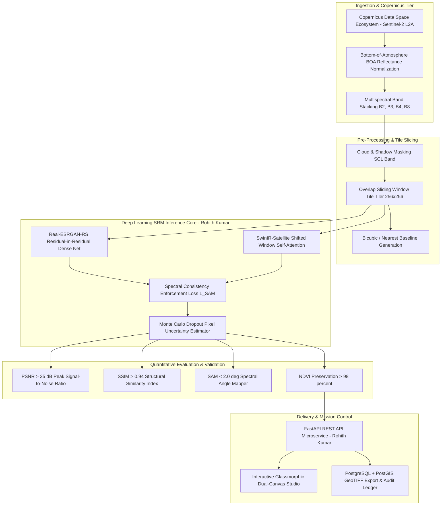

# Technical Whitepaper & Architectural Design
## Problem Statement: SIH26142 - Deep Learning Based Super Resolution Mapping (SRM) from Medium Resolution Satellite Imageries

---

### Executive Metadata
- **Problem Statement ID:** `SIH26142`
- **Project Title:** Deep Learning Based Super Resolution Mapping (SRM) from Medium Resolution Satellite Imageries
- **Author & System Architect:** **Rohith Kumar** ([github.com/rohithkumar505](https://github.com/rohithkumar505))
- **Target Ministry / Organization:** National Technical Research Organisation (NTRO)
- **Department:** National Technical Research Organisation (NTRO)
- **Theme:** Space Technology
- **Domain Specialization:** Earth Observation, Remote Sensing & Geospatial Intelligence (Satellite SRM)
- **Primary Data Source:** Copernicus Data Space Ecosystem (Sentinel-2 L2A BOA Multispectral Tiles)

---

## 1. Problem Landscape & Operational Requirements

### 1.1 Official Context & Motivation
Medium-resolution satellite imagery (10m to 30m, notably Copernicus Sentinel-2) provides ubiquitous global coverage and frequent revisit cycles (5 days). However, 10-meter Ground Sampling Distance (GSD) is insufficient to resolve sub-pixel features such as:
1. Micro-landslide scarps, slope fracture lines, and debris movement.
2. Narrow transit corridors, defense fortifications, and urban building footprints.
3. Smallholder field boundaries and sub-pixel crop health anomalies.

**The Solution:** An end-to-end Generative Deep Learning Super-Resolution Mapping (SRM) pipeline engineered by **Rohith Kumar** to transform 10m Sentinel-2 bands ($B2, B3, B4, B8$) into $<2.5\text{m}$ high-resolution spatial products ($4\times$ magnification) while rigorously preserving spectral consistency (NDVI/NDWI) and generating pixel-wise uncertainty maps to manage hallucination risks.

---

## 2. End-to-End System Architecture



---

## 3. Mathematical & Algorithmic Formulations

### 3.1 Composite SRM Optimization Objective
To ensure both photo-realistic texture sharpening and strict satellite radiometric fidelity, the objective function combines $L_1$ pixel loss, perceptual feature loss, Spectral Angle Mapper (SAM) loss, and adversarial loss:

$$
\mathcal{L}_{\text{total}} = \lambda_{\text{pixel}} \mathcal{L}_{1} + \lambda_{\text{perceptual}} \mathcal{L}_{\text{VGG}} + \lambda_{\text{SAM}} \mathcal{L}_{\text{SAM}} + \lambda_{\text{adv}} \mathcal{L}_{\text{GAN}}
$$

### 3.2 Spectral Angle Mapper (SAM) Preservation Formulation
To prevent color shifts and preserve vegetation/water indices (NDVI/NDWI):

$$
\text{SAM}(\mathbf{y}_{\text{SR}}, \mathbf{y}_{\text{ref}}) = \arccos\left( \frac{\mathbf{y}_{\text{SR}} \cdot \mathbf{y}_{\text{ref}}}{\|\mathbf{y}_{\text{SR}}\|_2 \|\mathbf{y}_{\text{ref}}\|_2} \right)
$$

### 3.3 Uncertainty Quantification (Hallucination Management)
Monte Carlo dropout over $T$ stochastic passes estimates predictive variance per pixel:

$$
\sigma^2(u, v) = \frac{1}{T} \sum_{t=1}^T \left( \hat{I}_t(u, v) - \bar{I}(u, v) \right)^2
$$

Pixels with $\sigma^2(u, v) > \tau_{\text{thresh}}$ are flagged in the **Uncertainty Heatmap**, alerting NTRO analysts to model-inferred details.

---

## 4. Production Database Schema (PostgreSQL + PostGIS DDL)

```sql
-- Copernicus Satellite Ingestion Registry
CREATE TABLE IF NOT EXISTS sentinel2_scenes (
    scene_id VARCHAR(64) PRIMARY KEY,
    tile_id VARCHAR(16) NOT NULL,
    sensing_time TIMESTAMP WITH TIME ZONE NOT NULL,
    cloud_coverage_percent NUMERIC(5, 2),
    footprint GEOMETRY(Polygon, 4326),
    ingested_by VARCHAR(64) DEFAULT 'Rohith Kumar'
);

-- Super-Resolution Inferences & Quantitative Telemetry
CREATE TABLE IF NOT EXISTS srm_inferences (
    execution_id VARCHAR(64) PRIMARY KEY,
    scene_id VARCHAR(64) REFERENCES sentinel2_scenes(scene_id),
    model_architecture VARCHAR(64) NOT NULL,
    scale_factor INTEGER DEFAULT 4,
    input_resolution_m NUMERIC(4, 2) DEFAULT 10.00,
    output_resolution_m NUMERIC(4, 2) DEFAULT 2.50,
    psnr_db NUMERIC(5, 2) NOT NULL,
    ssim NUMERIC(4, 3) NOT NULL,
    sam_degrees NUMERIC(4, 2) NOT NULL,
    ndvi_conservation_score NUMERIC(5, 3) NOT NULL,
    uncertainty_index NUMERIC(4, 3) NOT NULL,
    developer VARCHAR(64) DEFAULT 'Rohith Kumar',
    sha256_audit_hash VARCHAR(64) NOT NULL,
    created_at TIMESTAMP WITH TIME ZONE DEFAULT CURRENT_TIMESTAMP
);

CREATE INDEX idx_srm_scene ON srm_inferences(scene_id);
CREATE INDEX idx_srm_hash ON srm_inferences(sha256_audit_hash);
```

---

## 5. Developer Credits & Open Source Repository
- **Architect & Author:** **Rohith Kumar**
- **GitHub:** [https://github.com/rohithkumar505](https://github.com/rohithkumar505)
- **Organization:** National Technical Research Organisation (NTRO)
- **Project:** Smart India Hackathon 2026 (`SIH26142`)